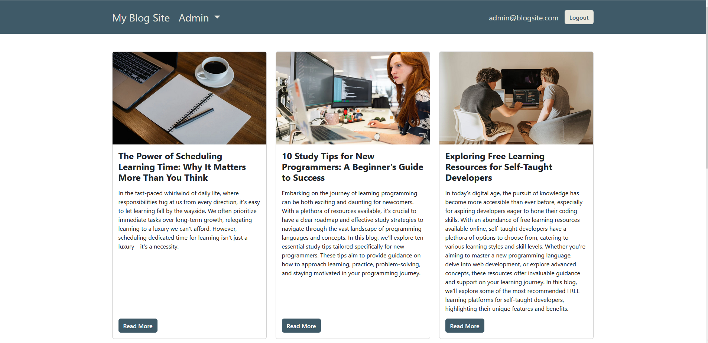
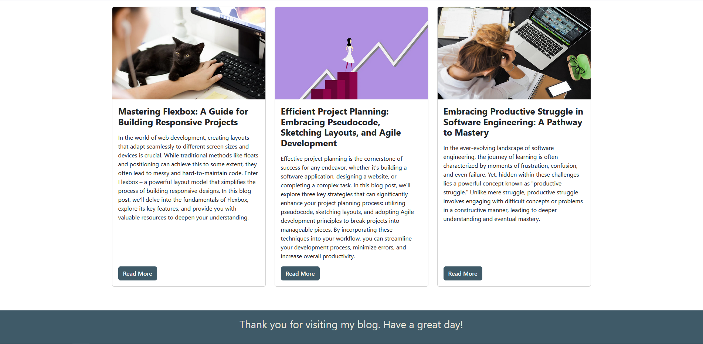
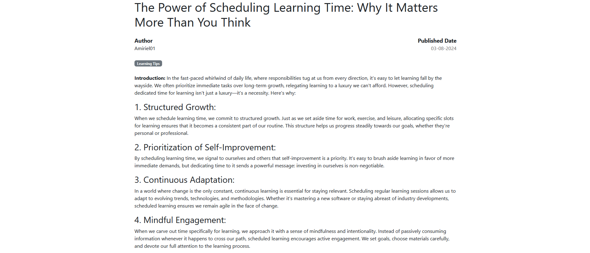
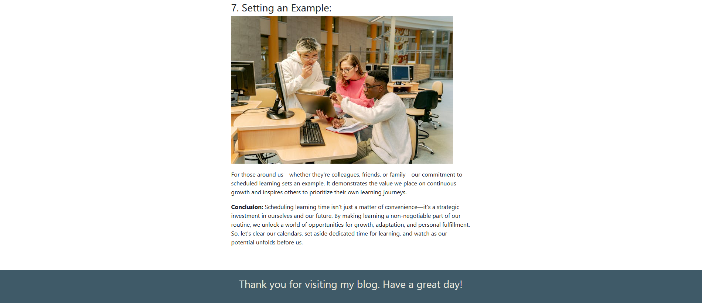
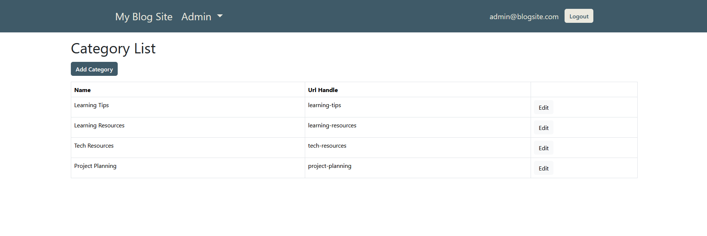
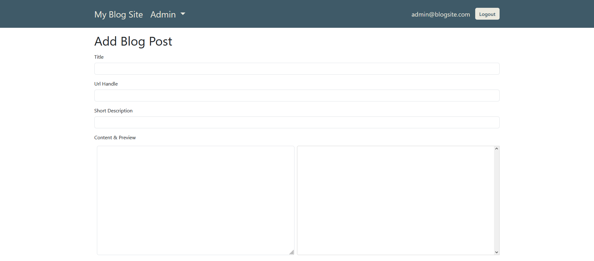
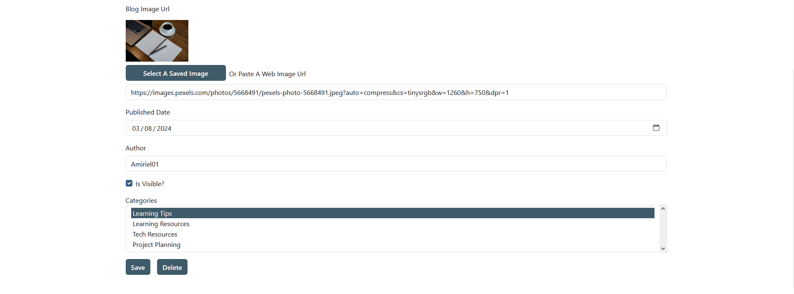
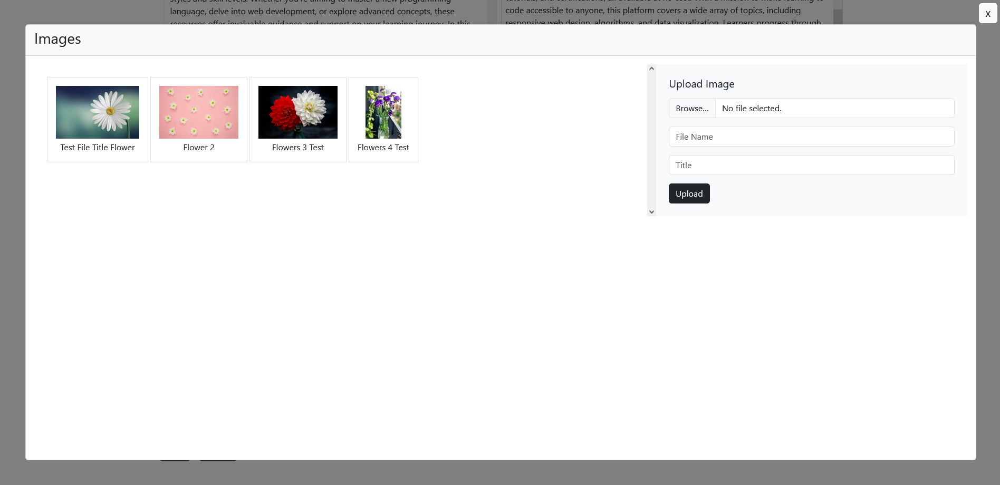

<a name="readme-top"></a>

<br />
<div align="center">
  
<h3 align="center">My Blog Site</h3>

  <p align="center">
    Angular & TypeScript Frontend to be used with BlogSiteAPI
    <br />
    <a href="https://blogsite-8fced.web.app/" target="_blank">View Demo</a>
    ·
    <a href="https://github.com/Amiriel01/BlogSiteUI/issues" target="_blank">Report Bug</a>
    ·
    <a href="https://github.com/Amiriel01/BlogSiteUI/issues" target="_blank">Suggestions</a>
  </p>
</div>

<details>
  <summary>Table of Contents</summary>
  <ol>
    <li>
      <a href="#about-the-project">About The Project</a>
      <ul>
        <li><a href="#website-features">Website Features</a></li>
      </ul>
      <ul>
        <li><a href="#built-with">Built With</a></li>
      </ul>
    </li>
    <li>
      <a href="#getting-started">Getting Started</a>
      <ul>
        <li><a href="#installation">Installation</a></li>
      </ul>
    </li>
    <li><a href="#contributing">Contributing</a></li>
    <li><a href="#acknowledgments">Acknowledgments</a></li>
  </ol>
</details>

## About The Project

I created a blog website using Angular, JavaScript, TypeScript, JWT, Webpack, HTML, and CSS. The blog website has a view for individuals who are not logged in and one for the admin user who runs the site. I used a JWT Token to authenticate the user and also role validation in case a non-admin logged in. This frontend Angular site connects with the BlogSiteAPI that can be viewed in my repositories also. The BlogSiteAPI utilizes ASP.NET Core Web API, Entity Framework Core, and C#. Please allow time for the site to spin up when visiting. Thank you!

If you notice any bugs or have an idea to make this website even better please use the links above to make your suggestions! Thank you in advance for viewing my website. 

<p align="right">(<a href="#readme-top">back to top</a>)</p>

### Website Features

The first page viewers see when accessing the website is the homepage. The Homepage displays the Header, blog cards, and the Footer. The Header and Footer can be viewed on this page and the blog details page. 

The header lists the site name, My Blog Site, when the name is clicked the viewer is always routed back to the homepage. If the user is not a logged in admin they will only see the blog name and a login button. If the user is a logged in admin they will see the site name, the admin dropdown, their admin email, and the logout button.

The Homepage is viewable by all users, the only difference on this page between a viewer and admin is the header. The blog cards show the blog image, title, and a short description of the article.

***Header User: (non-admin):***


***Header Admin:***


***Homepage:***





From the homepage users can click the "Read More" button on any article to be routed to the blog details page. All blogs have a blog image, placed at the top of the blog, this image matches the blog card image from the homepage. Each blog details page also has the blog title, author, date published, category badge(s), and the full blog post. Depending on which blog the user visits, they will also see additional images, links, or lists. The blog details page is viewable to admin and visitors, the only difference on this page is the header.

***Example Blog Post***







If a viewer is also an admin they can login using the "Login" button in the header. They will be routed to the login form page. The admin will enter their username and password to be allowed to access the admin features. If the user enters the wrong username and password combination an alert will be shown.


 The rest of the blog pages and features are only viewable to the logged in admin user. Once the admin has access to the admin menu they are given two options to choose. 
 
The first option in the dropdown is "Categories". Upon clicking "Categories" the user will be able to view the category list page. This page has an "Add Category" button and a table that shows the Name, Url Handle, and "Edit" buttons for making edits to the categories. 

 

The forms on each page are alike, with the only differences being the additional button and pre-populated information in the edit form.


The second option in the dropdown is "Blog Posts". Upon clicking "Blog Posts" the user will be able to view the blog post list page. This page has an "Add Blog Post" button and a table that shows the Title, Short Description, whether the blog post is visible to viewers, the category badges, and "Edit" buttosn for making edits to the blog posts. 

 

The forms on each page are alike, with the only differences being the additional button and pre-populated information in the edit form.






The "Select Image" button takes the admin to a modal that lets the admin upload images from their computer. Admin are also able to place an image url in the form if they have a url instead. The url input can be seen in the add and edit form images.



<p align="right">(<a href="#readme-top">back to top</a>)</p>

### Built With

* [![Angular][Angular.io]][Angular-url]
* [![JavaScript][JavaScript.io]][JavaScript-url]
* [![TypeScript][TypeScript.com]][TypeScript-url]
* [![JWT][JWT.io]][JWT-url]
* [![HTML5][HTML5.io]][HTML5-url]
* [![Bootstrap][Bootstrap.com]][Bootstrap-url]
* [![CSS3][CSS3.io]][CSS3-url]
* [![Webpack][Webpack.io]][Webpack-url]
* [![NPM][NPM.io]][NPM-url]
* [![VSCode][VSCode.com]][VSCode-url]

<p align="right">(<a href="#readme-top">back to top</a>)</p>

## Getting Started

To get a local copy up and running follow these simple example steps.

### Installation

1. Clone the repo
   ```sh
   git clone https://github.com/Amiriel01/Public-Library-Website
   ```
2. Install NPM packages
   ```sh
   npm install
   ```

<p align="right">(<a href="#readme-top">back to top</a>)</p>

## Contributing

Contributions are what make the open source community such an amazing place to learn, inspire, and create. Any contributions you make are **greatly appreciated**.

If you have a suggestion that would make this better, please fork the repo and create a pull request. You can also simply open an issue with the tag "enhancement".
Don't forget to give the project a star! Thanks again!

1. Fork the Project
2. Create your Feature Branch (`git checkout -b feature/AmazingFeature`)
3. Commit your Changes (`git commit -m 'Add some AmazingFeature'`)
4. Push to the Branch (`git push origin feature/AmazingFeature`)
5. Open a Pull Request

<p align="right">(<a href="#readme-top">back to top</a>)</p>


## Acknowledgments

* [Pexels: Website Images](https://www.pexels.com/)

<p align="right">(<a href="#readme-top">back to top</a>)</p>

[CSS3.io]: https://img.shields.io/badge/css3-%231572B6.svg?style=for-the-badge&logo=css3&logoColor=white
[CSS3-url]: https://developer.mozilla.org/en-US/docs/Web/CSS
[HTML5.io]: https://img.shields.io/badge/html5-%23E34F26.svg?style=for-the-badge&logo=html5&logoColor=white
[HTML5-url]: https://html.spec.whatwg.org/multipage/
[JavaScript.io]: https://img.shields.io/badge/javascript-%23323330.svg?style=for-the-badge&logo=javascript&logoColor=%23F7DF1E
[JavaScript-url]: https://developer.mozilla.org/en-US/docs/Web/JavaScript
[Angular.io]: https://img.shields.io/badge/Angular-DD0031?style=for-the-badge&logo=angular&logoColor=white
[Angular-url]: https://angular.io/
[Bootstrap.com]: https://img.shields.io/badge/Bootstrap-%238511FA?style=for-the-badge&logo=bootstrap&logoColor=white
[Bootstrap-url]: https://getbootstrap.com
[TypeScript.com]: https://img.shields.io/badge/typescript-%23007ACC.svg?style=for-the-badge&logo=typescript&logoColor=white
[TypeScript-url]: https://www.typescriptlang.org/
[NPM.io]: https://img.shields.io/badge/NPM-%23CB3837.svg?style=for-the-badge&logo=npm&logoColor=white
[NPM-url]: https://www.npmjs.com/
[VSCode.com]: https://img.shields.io/badge/Visual%20Studio-5C2D91.svg?style=for-the-badge&logo=visual-studio&logoColor=white
[VSCode-url]: https://code.visualstudio.com/
[JWT.io]: https://img.shields.io/badge/JWT-black?style=for-the-badge&logo=JSON%20web%20tokens
[JWT-url]: https://jwt.io/introduction
[Webpack.io]: https://img.shields.io/badge/webpack-%238DD6F9.svg?style=for-the-badge&logo=webpack&logoColor=black
[Webpack-url]: https://webpack.js.org/


